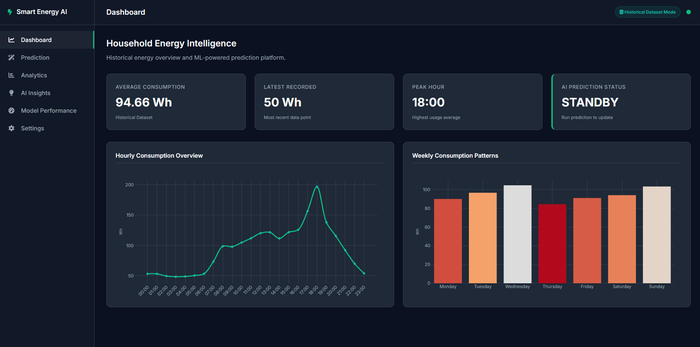
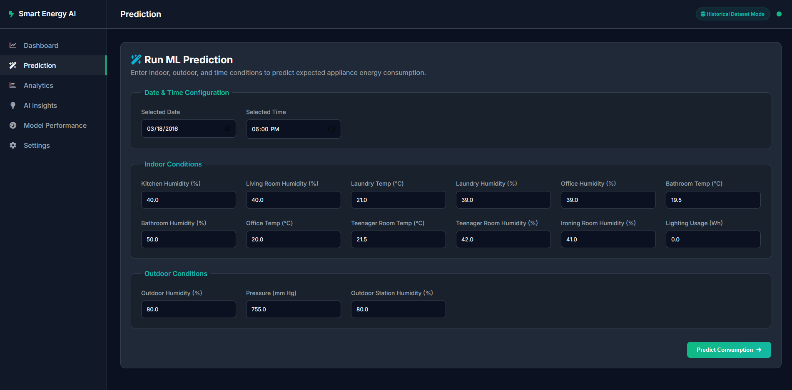
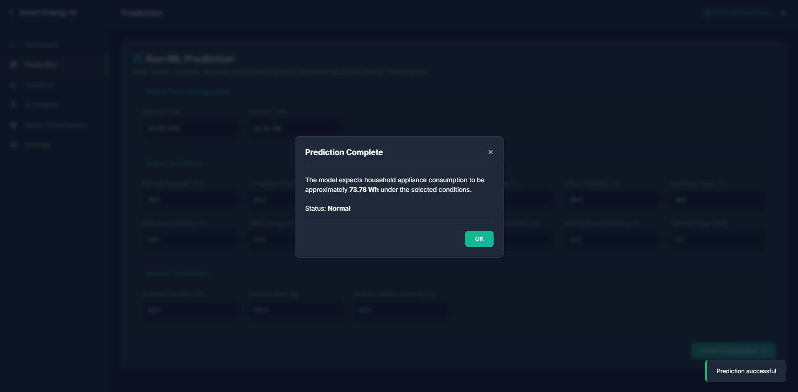
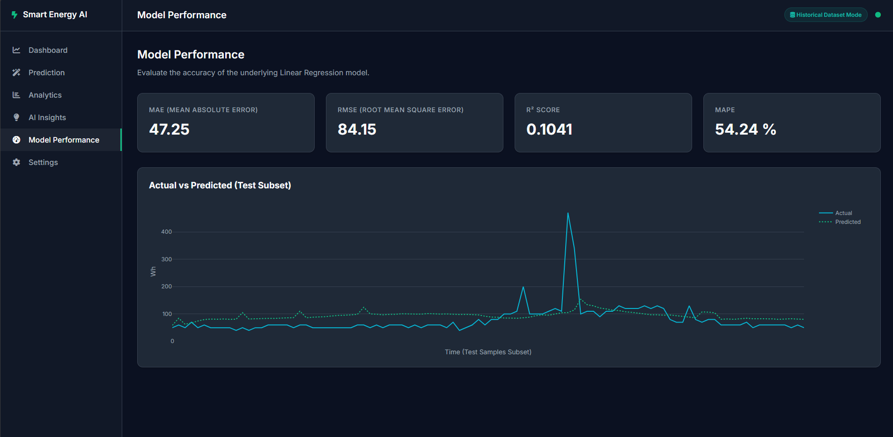
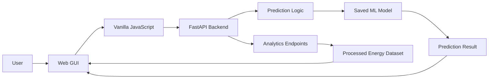
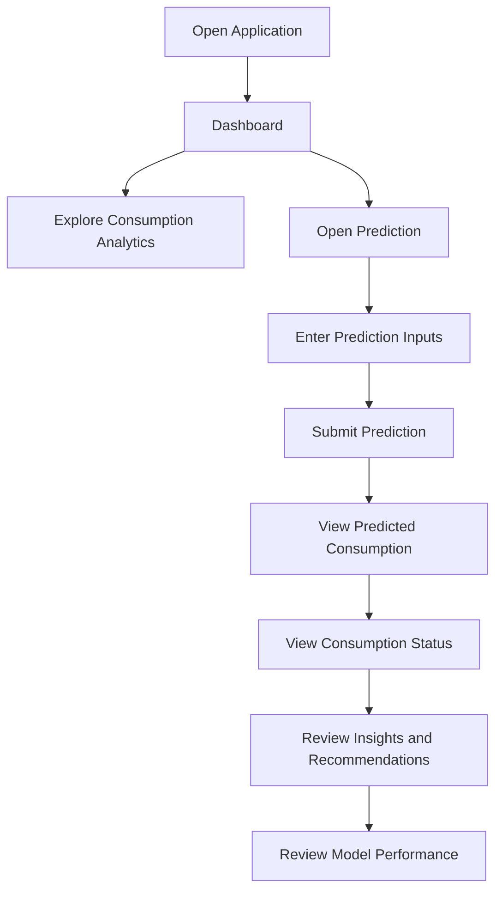

# Smart Energy AI

## Project Overview

Smart Energy AI is a machine learning system that **predicts household appliance energy consumption** (in Watt-hours) from indoor environmental sensor data, outdoor weather conditions, and time of day.

The project is built as a complete academic ML pipeline: data cleaning → EDA → feature engineering → model training → evaluation → hyperparameter tuning → deployment.

---

## Problem Statement

Household residents typically have no way to anticipate how much electricity their appliances will consume or when consumption will spike. This project builds a regression model that predicts `Appliances` energy use (Wh) from sensor readings, enabling users to:

- Understand expected electricity consumption before it occurs
- Identify high-usage periods and take action to reduce them
- Build awareness of the environmental conditions that drive energy use

---

## Project Goal

Train and deploy a regression model that accepts real-world sensor readings and returns a predicted appliance energy consumption in Watt-hours (Wh), together with a binary indicator of whether the predicted consumption is high.

---

## Machine Learning Task

| Task | Details |
|---|---|
| **Primary task** | Regression — predict `Appliances` energy use in Wh |
| **High-consumption status** | Threshold-based status derived from the regression prediction |
| **Threshold** | Loaded from the saved model bundle at runtime |

---

## Dataset

| Property | Value |
|---|---|
| **Name** | Appliances Energy Prediction Data Set |
| **Source** | [Kaggle](https://www.kaggle.com/datasets/sohommajumder21/appliances-energy-prediction-data-set) |
| **Observations** | 19,735 rows |
| **Columns** | 29 columns |
| **Collection period** | January 11 – May 27, 2016 |
| **Collection frequency** | Every 10 minutes |
| **Target variable** | `Appliances` — household appliance energy consumption (Wh) |

---

## Features

### Original Features (29 columns)

| Feature | Description | Unit |
|---|---|---|
| `date` | Date and time of observation | Timestamp |
| `Appliances` | Household appliance energy use (target) | Wh |
| `lights` | Energy used by lighting fixtures | Wh |
| `T1` | Kitchen temperature | °C |
| `RH_1` | Kitchen humidity | % |
| `T2` | Living room temperature | °C |
| `RH_2` | Living room humidity | % |
| `T3` | Laundry room temperature | °C |
| `RH_3` | Laundry room humidity | % |
| `T4` | Office room temperature | °C |
| `RH_4` | Office room humidity | % |
| `T5` | Bathroom temperature | °C |
| `RH_5` | Bathroom humidity | % |
| `T6` | Outside north side temperature | °C |
| `RH_6` | Outside north side humidity | % |
| `T7` | Ironing room temperature | °C |
| `RH_7` | Ironing room humidity | % |
| `T8` | Teenager room 2 temperature | °C |
| `RH_8` | Teenager room 2 humidity | % |
| `T9` | Parents room temperature | °C |
| `RH_9` | Parents room humidity | % |
| `T_out` | Outdoor temperature | °C |
| `Press_mm_hg` | Atmospheric pressure | mm Hg |
| `RH_out` | Outdoor humidity | % |
| `Windspeed` | Wind speed | m/s |
| `Visibility` | Visibility | km |
| `Tdewpoint` | Dew point temperature | °C |
| `rv1` | Random variable 1 (noise) | — |
| `rv2` | Random variable 2 (noise) | — |

### Final Model Features (19 features)

15 original sensor features selected by Random Forest importance (computed on training data only):

`lights`, `RH_out`, `Press_mm_hg`, `RH_1`, `RH_2`, `RH_8`, `RH_5`, `T3`, `RH_3`, `RH_6`, `T4`, `T8`, `RH_7`, `RH_4`, `T5`

Plus 4 engineered time features:

`hour`, `day_of_week`, `month`, `is_weekend`

---

## Data Cleaning

| Check | Result |
|---|---|
| Duplicate rows | 0 found |
| Missing values | 0 found |
| Invalid dates | 0 after using `dayfirst=True` |
| Negative energy values | 0 found |
| Outliers (IQR method) | Retained — represent legitimate high-consumption events |
| Cleaned dataset | `data/processed/energydata_cleaned.csv` |

---

## EDA Highlights

- The `Appliances` target is **right-skewed** (skewness ≈ 3.39): most observations fall in a moderate range (median ≈ 60 Wh), with occasional spikes up to 1080 Wh
- Average consumption peaks in the **evening hours** (consistent with cooking and other household activities)
- Consumption is **lower in warmer months** (lower heating demand)
- Individual feature correlations with the target are weak (< 0.2), indicating that the available variables alone do not strongly explain appliance consumption

---

## Feature Engineering

Four interpretable time-based features were created from the `date` column:

| Feature | Description | Why useful |
|---|---|---|
| `hour` | Hour of day (0–23) | Captures the daily usage cycle (highest importance) |
| `day_of_week` | Day of week (0=Monday) | Weekday vs. weekend patterns |
| `month` | Month of year (1–12) | Seasonal heating/cooling patterns |
| `is_weekend` | 1 if Saturday/Sunday | Weekend activity patterns differ from weekdays |

**PCA:** 11 components were needed to retain 95% of variance in the 19-feature set. PCA was **not applied** in the final model to preserve interpretability.

---

## Models

Three regression models were trained using a **chronological 80/20 train/test split**:

| Model | Preprocessing |
|---|---|
| Linear Regression | StandardScaler applied |
| Random Forest Regressor | Raw features (no scaling needed) |
| Gradient Boosting Regressor | Raw features (no scaling needed) |

**Cross-validation:** `TimeSeriesSplit` (3 splits) on the training set only.

---

## Evaluation Results

### Regression Metrics

| Model | CV RMSE (train) | MAE | RMSE | R² |
|---|---|---|---|---|
| **Linear Regression** | 102.17 | 52.67 | 87.92 | 0.0673 |
| Random Forest | 101.36 | 110.00 | 148.71 | -1.6683 |
| Gradient Boosting | 107.13 | 121.78 | 162.19 | -2.1739 |

**Note:** Tree-based models show a distribution-shift effect — the training period (January–April) is cooler than the test period (late April–May), causing the models to overestimate consumption in the test set.

### Hyperparameter Tuning

Tuned Random Forest with `RandomizedSearchCV` + `TimeSeriesSplit`:

- **Best params:** `n_estimators=160, max_depth=15, min_samples_leaf=10, max_features='sqrt'`
- Baseline RF RMSE: 148.71 → Tuned RF RMSE: **118.44** (improvement)
- Despite improvement, Linear Regression still generalizes better on this test period


---

## Best Model

**Linear Regression** — the only model with a positive R² on the chronological test set. Selected for deployment because it generalizes best across the seasonal distribution shift between the training and test periods.

---

## Project Structure

```text
Smart-Energy-AI/
├── data/
│   ├── processed/
│   │   └── energydata_cleaned.csv
│   └── raw/
│       └── energydata_complete.csv
├── docs/
│   └── screenshots/
│       ├── ai-insights.png
│       ├── dashboard.png
│       ├── model-performance.png
│       ├── prediction-result.png
│       ├── prediction.png
│       └── settings.png
├── models/
│   ├── final_model.joblib
│   └── scaler.joblib
├── notebooks/
│   └── smart_energy_ai.ipynb
├── reports/
├── src/
│   ├── data_preprocessing.py
│   ├── predict.py
│   └── train.py
├── static/
│   ├── css/
│   │   └── style.css
│   └── js/
│       ├── app.js
│       └── charts.js
├── templates/
│   └── index.html
├── README.md
├── app.py
└── requirements.txt
```

---

## Technology Stack

### Backend

- Python
- FastAPI
- Uvicorn
- Pydantic
- Jinja2

The supplied `app.py` creates a FastAPI application and mounts the static directory and Jinja2 templates. fileciteturn13file1L664-L685

### Machine Learning

- Pandas
- NumPy
- Scikit-learn
- Joblib

The application loads the saved model bundle from `models/final_model.joblib` and uses its model, scaler, selected features, and high-consumption threshold. fileciteturn13file1L688-L695

### Frontend

- HTML5
- CSS3
- Vanilla JavaScript
- Plotly.js
- Font Awesome
- Google Fonts

The HTML page loads Plotly.js, Font Awesome, the project CSS, and the two JavaScript files from the `static/` directory. fileciteturn13file3L901-L914

---

## Web Application

The application is a FastAPI-based web dashboard for historical household energy analysis and ML-powered prediction.

The backend serves `index.html` at `/`, exposes the static assets under `/static`, and loads the Jinja2 templates from the `templates/` directory. fileciteturn13file1L679-L685 fileciteturn13file1L754-L756

The frontend contains the following main sections:

- Dashboard
- Prediction
- Analytics
- AI Insights
- Model Performance
- Settings

These sections are defined directly in the supplied HTML interface. fileciteturn13file3L924-L930

The frontend communicates with the backend using JavaScript `fetch()` requests. The prediction form sends a POST request to `/api/predict`, while dashboard and settings data are loaded from API endpoints. fileciteturn12file2L70-L108 fileciteturn12file2L121-L155

### Prediction Flow

1. The user selects a date and time.
2. The user enters the required environmental and lighting values.
3. The frontend sends the values to `/api/predict`.
4. The backend derives `hour`, `day_of_week`, `month`, and `is_weekend` from the selected date and time.
5. The saved scaler and model are used to generate the prediction.
6. The prediction is returned in Wh and kWh.
7. The result is labeled `High` or `Normal` according to the saved threshold.
8. The frontend displays the result and generates an insight/recommendation.

The backend implementation performs these steps directly in the prediction route. fileciteturn13file1L779-L800

### Analytics

The backend currently exposes:

```text
/api/analytics/summary
/api/analytics/hourly
/api/analytics/daily
/api/analytics/weekly
/api/analytics/monthly
/api/analytics/heatmap
/api/analytics/peak-hours
```

These endpoints calculate historical consumption summaries, hourly and daily patterns, weekly and monthly averages, a day-versus-hour heatmap, and the top three peak hours. fileciteturn13file1L803-L848

### Model Performance

The application exposes:

```text
/api/model/performance
```

It evaluates the saved model on the last 20% of the historical data and returns MAE, RMSE, R², MAPE, and subsets of actual versus predicted values for visualization. fileciteturn13file1L851-L869

### Model Comparison

The current backend exposes:

```text
/api/model/comparison
```

but returns `available: false` because comparison results were not saved with the project. fileciteturn13file1L872-L875

---

## Installation

### 1. Clone the Repository

```bash
git clone https://github.com/YoussefAtef15/Smart-Energy-Consumption-Prediction.git
cd Smart-Energy-Consumption-Prediction
```

### 2. Create a Virtual Environment

Windows PowerShell:

```powershell
python -m venv .venv
.venv\Scripts\Activate.ps1
```

Windows Command Prompt:

```cmd
python -m venv .venv
.venv\Scripts\activate
```

Linux/macOS:

```bash
python3 -m venv .venv
source .venv/bin/activate
```

### 3. Upgrade pip

```bash
python -m pip install --upgrade pip
```

### 4. Install Dependencies

```bash
python -m pip install -r requirements.txt
```

The current dependency file includes Pandas, NumPy, Scikit-learn, Joblib, FastAPI, Uvicorn, and Jinja2. fileciteturn13file2L885-L891

---

## How to Run

### 1. Activate the Virtual Environment

Windows PowerShell:

```powershell
.venv\Scripts\Activate.ps1
```

Windows Command Prompt:

```cmd
.venv\Scripts\activate
```

Linux/macOS:

```bash
source .venv/bin/activate
```

### 2. Start the FastAPI Application with Uvicorn

Run:

```bash
python -m uvicorn app:app --reload
```

The project is designed around FastAPI and Uvicorn. The supplied `app.py` creates `app = FastAPI(...)`, while `requirements.txt` includes both FastAPI and Uvicorn. fileciteturn13file1L672-L685 fileciteturn13file2L889-L891

Open:

```text
http://127.0.0.1:8000
```

### 3. FastAPI Interactive API Documentation

FastAPI provides interactive API documentation at:

```text
http://127.0.0.1:8000/docs
```

A ReDoc version is also available at:

```text
http://127.0.0.1:8000/redoc
```

### 4. Train the Model

```bash
python src/train.py
```

The training pipeline prepares the data, performs feature engineering and model training, evaluates the models, and saves the deployment artifacts used by the application.

### 5. Run the Notebooks

Start Jupyter:

```bash
jupyter notebook
```

Then open:

```text
notebooks/smart_energy_ai.ipynb
```

or:

```text
notebooks/SMART_ENERGY.ipynb
```

---

## Limitations

1. **Seasonal distribution shift:** The dataset spans only 4.5 months (Jan–May). The test period (late April–May) has higher outdoor temperatures than the training period, causing tree-based models to overestimate consumption. Collecting data over a full year would reduce this effect.

2. **Low R² on test set:** Linear Regression achieves R² ≈ 0.067, indicating that the model captures only part of the variance in appliance consumption. The target has high noise and many unmeasured contributing factors.

3. **No occupancy information:** The dataset does not include occupancy counts or individual appliance labels, which limits predictive power.

4. **Single household:** The dataset comes from a single Belgian household and may not generalize to other households.

---

## Future Improvements

- Collect data over a full year to reduce the seasonal distribution-shift effect
- Add occupancy sensors as features
- Explore time-series specific models such as LSTM or Prophet
- Implement model monitoring to detect input drift from the training distribution
- Add individual appliance-level monitoring to improve interpretability


---

## Application Screenshots

The following screenshots are included directly from the current project and use repository-relative paths so they render correctly on GitHub.

### Dashboard

The main dashboard provides an overview of the application's energy data and key information.



### Prediction

The prediction interface allows users to provide the required inputs and request an appliance energy-consumption prediction.



### Prediction Result

The prediction result view presents the estimated appliance consumption and the corresponding consumption status.



### Model Performance

The Model Performance view presents the available evaluation information for the deployed model.



### AI Insights

The AI Insights interface presents consumption-related insights and recommendations available in the current application.


### Settings

The Settings page provides the available application and project information.


---

## Application Architecture



---

## User Workflow



---

## API Overview

The FastAPI backend provides the application's prediction and analytics functionality.

The current application includes functionality for:

- Application health checking
- Appliance energy-consumption prediction
- Historical consumption summaries
- Hourly consumption analytics
- Daily consumption analytics
- Weekly consumption analytics
- Monthly consumption analytics
- Model-performance evaluation

FastAPI provides automatically generated interactive API documentation at:

```text
http://127.0.0.1:5000
```

---

## Model Deployment

The trained model artifacts are stored in the `models/` directory.

```text
models/
├── final_model.joblib
└── scaler.joblib
```

The application loads the saved model bundle when the FastAPI application starts and uses it for prediction requests.

The prediction workflow derives the required time-based features from the selected date and time before passing the prepared inputs to the model.

---

## Reproducibility

The project keeps the main stages of the machine learning workflow organized across notebooks and source files.

The main end-to-end notebook is:

```text
notebooks/smart_energy_ai.ipynb
```

The notebooks currently included in the repository are:

```text
notebooks/SMART_ENERGY.ipynb
notebooks/smart_energy_ai.ipynb
```

The source implementation is organized into:

```text
src/data_preprocessing.py
src/train.py
src/predict.py
```

This structure makes it possible to inspect the data preparation, training, evaluation, and prediction stages separately.

---

## Repository Documentation

Additional project documentation and generated outputs are organized under:

```text
docs/
reports/
```

The application screenshots are stored specifically under:

```text
docs/screenshots/
```

All screenshot references in this README use relative repository paths. This means GitHub can resolve them after the repository is uploaded without requiring local Windows paths or external image hosting.

---

## Current Project Status

### Completed

- Real-world household energy dataset preparation
- Data quality checks
- Exploratory Data Analysis
- Time-based feature engineering
- Feature selection
- Chronological train/test split
- Regression model training
- Time-series cross-validation
- Random Forest hyperparameter tuning
- Model evaluation
- Best-model selection
- Saved model artifacts
- FastAPI backend
- HTML/CSS/Vanilla JavaScript web interface
- Plotly.js visualizations
- Energy-consumption prediction
- Historical consumption analytics
- Peak-hour analysis
- AI Insights and recommendations interface
- Model Performance interface
- Settings interface
- Application screenshots and project documentation

### Partially Completed

- Model Comparison is not currently available as a fully functional comparison view in the deployed application.
- The predictive performance is affected by the limited time coverage and distribution shift in the available dataset.

### Pending

- Full-year energy data collection
- Improved generalization across different households
- Additional predictive features such as occupancy information
- Advanced time-series models
- Model monitoring and drift detection
- Expanded appliance-level prediction
- A fully functional Model Comparison interface

---

## Future Improvements

- Collect data over a full year to reduce the seasonal distribution-shift effect
- Add occupancy sensors as features
- Explore time-series specific models such as LSTM or Prophet
- Implement model monitoring to detect input drift from the training distribution
- Add individual appliance-level monitoring to improve interpretability


